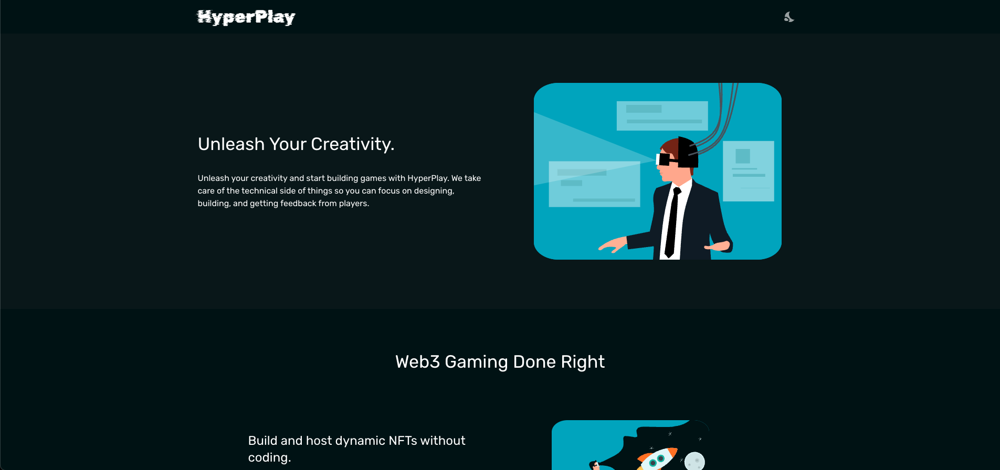

# HyperPlay-Landing-Page-Public
_REACT application with express server Containerized for Google Cloud Run_

 




## Description

A landing page built using REACT.js.

## Quick Start
### Using Docker
```
sudo docker build . -t hyperplay-landing
```

### Using NPM - Production Start
__This will delete the client folder!!__
#### Install Dependencies
```
bash scripts/install.sh
```

#### Start Command
```
cd server
npm run start
```
## Development
### Dev Container
Activate Development container using your prefered IDE.
### Using NPM - Development Start
#### Install Dependencies for Development
```
npm run devSetup
```
#### Start for Development - _Nodemon_
```
npm run devStart
```